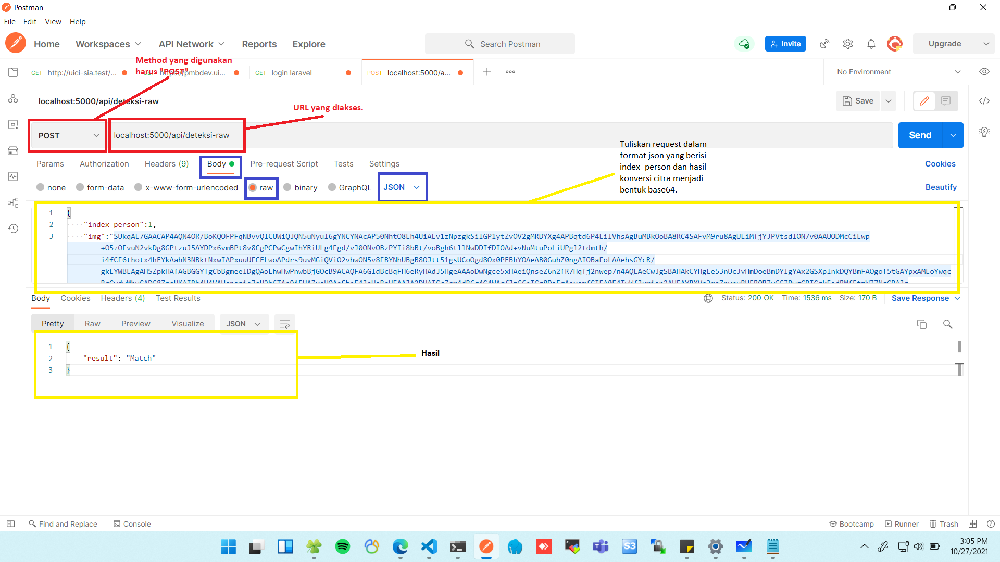
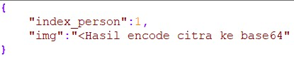

`set FLASK_APP=app`  
`set FLASK_ENV=development`  
`flask run`  
  

`pip uninstall opencv-python`
`pip install -U opencv-contrib-python==3.4.2.16`
  

`https://www.browserling.com/tools/image-to-base64`

## Panduan Setup  
- Download program ini.  
- Disarankan memuat virtual environment terlebih dahulu dengan cara berikut : `virtualenv .env` untuk python native dan `conda create -n <nama virtual env>` untuk anaconda.  
- Masuk ke virtual environment dengan cara berikut : `.env\Scripts\activate.bat` untuk python native dan `conda activate <nama virtual env>` untuk anaconda.  
- Setelah masuk ke virtual environment, install semua package yang diperlukan dengan menggunakan perintah `pip install -r requirements.txt`.  
- Aplikasi dapat dijalankan dengan perintah `run.bat`.  
  
  
## Panduan mengakses API  
- API dapat diakses menggunakan aplikasi postman yang dapat diunduh pada link berikut `https://www.postman.com/downloads/`.  
- Request akan dikirimkan dengan data berformat json sehingga gambar input terlebih dahulu harus dikonversi menjadi bentuk base64.  
- Anda dapat menggunakan layanan `https://www.browserling.com/tools/image-to-base64` untuk mengkonversi gambar menjadi bentuk base64.  
- Perhatikan gambar berikut dalam pengoperasion postman.  
 
- Jika sudah sesuai, maka tekan tombol "send".    
- Berikut merupakan contoh format request.  
 